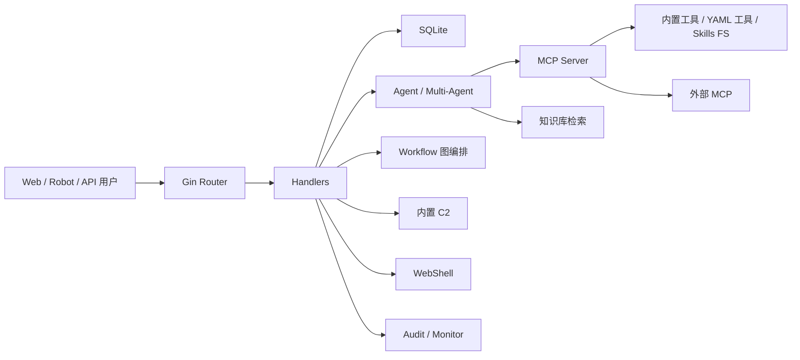

# 架构说明

CyberStrikeAI 是一个以 Web 管理面为入口、以 Agent 和 MCP 工具为执行核心的安全测试编排平台。

## 总览

## Web 层

入口在 `cmd/server/`，应用组装在 `internal/app/`。Web 使用 Gin：

- `web/templates/index.html`：主页面。
- `web/templates/api-docs.html`：API 文档页面。
- `web/static/js/`：各业务模块前端逻辑。
- `web/static/css/`：样式。

路由注册集中在 `internal/app/app.go`。

## Handler 层

`internal/handler/` 按业务拆分：

- `agent.go`、`eino_single_agent.go`、`multi_agent.go`
- `workflow.go`、`workflow_run.go`
- `knowledge.go`
- `webshell.go`
- `c2.go`
- `audit.go`
- `monitor.go`
- `project.go`
- `vulnerability.go`
- `config.go`
- `openapi.go`

Handler 负责参数解析、权限中间件后的业务协调和 HTTP 响应。

## Agent 层

单代理和多代理主要在：

- `internal/agent/`
- `internal/multiagent/`
- `internal/agents/`
- `agents/`

Eino ADK 提供单代理、Deep、Plan-Execute、Supervisor 等执行模式。多代理子 Agent 由 Markdown 文件定义。

## MCP 与工具

MCP 相关：

- `internal/mcp/`：Server、外部 MCP、连接恢复。
- `internal/einomcp/`：Eino 与 MCP 工具适配。
- `tools/`：YAML 命令工具。
- `internal/app/*_tools.go`：Go 内置工具注册。

工具调用会进入监控记录，并可受 HITL 审批影响。

## Workflow

图编排在 `internal/workflow/`，HTTP 入口在 `internal/handler/workflow*.go`。它支持 start、agent、tool、condition、hitl、output、end 等节点。

详细使用见 [图编排使用说明](workflow-graph.md)。

## 知识库

知识库在 `internal/knowledge/`，包括：

- Markdown/文本内容管理。
- chunk。
- embedding。
- SQLite 向量索引。
- multi-query。
- rerank。
- 检索日志。

启用后会向 Agent 暴露知识检索工具。

## 数据层

`internal/database/` 封装 SQLite 访问，保存：

- 对话、消息、过程详情。
- 分组。
- 工具执行记录。
- HITL 日志。
- 知识库索引和检索日志。
- WebShell、C2、项目、漏洞、批量任务等业务数据。

默认数据库文件：

- `data/conversations.db`
- `data/knowledge.db`

## 安全与审计

`internal/security/` 提供认证、限流、Shell 执行和命令流处理。`internal/audit/` 和 `internal/monitor/` 分别负责平台审计和执行监控。

高风险模块包括：

- Terminal。
- WebShell。
- C2。
- 外部 MCP。
- 文件系统和 Shell Skills。

这些模块应结合角色、HITL 和部署隔离使用。

## 一次对话请求的真实路径

以 `/api/eino-agent/stream` 为例：

1. Gin 路由进入认证中间件。
2. Handler 解析请求体、会话 ID、角色、附件和 WebShell 上下文。
3. Agent 构建模型输入，包括历史消息、角色提示、项目事实、工具列表。
4. Eino Runner 调用模型。
5. 模型需要工具时走 MCP Tool。
6. 工具调用前可能触发 HITL。
7. 工具执行结果写入过程详情和监控。
8. 模型继续推理并生成最终回答。
9. SSE 将进度、工具事件、文本增量推给前端。
10. 会话、消息、过程详情写入 SQLite。

这个路径解释了为什么问题可能出在很多层：认证、会话、模型、工具、HITL、MCP、数据库、SSE 或前端渲染。

## 横向模块依赖

几个模块不是独立页面，而是横向能力：

- Project facts：会被注入 Agent 上下文，影响多轮和跨对话判断。
- HITL：插在工具调用前，影响所有 Agent/MCP 工具。
- Monitor：记录工具执行，影响任务取消、复盘和通知。
- Audit：记录平台管理动作，影响安全运营。
- Tool search：影响模型看见哪些工具，而不仅仅是工具页面显示。

改这些模块时要看全局调用点，不要只测单个页面。

## 复杂度热点

维护时优先警惕：

- `internal/app/app.go`：组装所有服务，容易引入初始化顺序问题。
- `internal/handler/config.go`：热应用配置，影响模型、知识库、C2、机器人和 MCP。
- `internal/multiagent/`：中间件多，流式、重试、摘要和工具调用交错。
- `internal/security/`：Shell 和认证是安全边界。
- `internal/database/`：SQLite 结构演进必须兼容旧数据。

## 设计取舍

项目选择单体 Go 服务 + SQLite + 静态前端，是为了降低部署门槛。但代价是：

- 多实例横向扩展不天然成立，尤其 SQLite 写入和内存 session。
- 运行态配置和本地文件强绑定，需要良好备份。
- 高权限工具和 Web 管理面在同一进程内，部署隔离更重要。

这些不是缺陷，而是部署时必须理解的边界。
