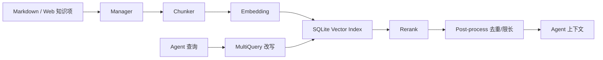

# 知识库

知识库用于把本地安全知识、漏洞手册、测试方法和组织经验转成可检索上下文，供 Agent 在任务中按需引用。

## 启用

```yaml
knowledge:
  enabled: true
  base_path: knowledge_base
  embedding:
    provider: openai
    model: text-embedding-v4
    base_url: ""
    api_key: ""
database:
  knowledge_db_path: data/knowledge.db
```

`embedding.base_url/api_key` 留空时会复用 `openai` 配置。建议知识库数据库独立保存，便于迁移和复用。

## 内容目录

默认目录是 `knowledge_base/`。项目中已有示例：

```text
knowledge_base/
  SQL Injection/
    README.md
    MySQL Injection.md
  Prompt Injection/
    README.md
```

推荐用一级目录表示风险类型或知识域，如：

- `SQL Injection`
- `XSS`
- `File Upload`
- `Cloud Security`
- `Incident Response`

## 管理流程

常见流程：

1. 把 Markdown 知识文件放到 `knowledge_base/`。
2. 在 Web 知识库页面扫描目录。
3. 重建索引。
4. 用搜索功能验证召回效果。
5. 在角色或任务中要求 Agent 优先查询知识库。

接口入口包括：

- `GET /api/knowledge/categories`
- `GET /api/knowledge/items`
- `POST /api/knowledge/scan`
- `POST /api/knowledge/index`
- `POST /api/knowledge/search`
- `GET /api/knowledge/index-status`
- `GET /api/knowledge/retrieval-logs`

## 索引

索引配置：

```yaml
knowledge:
  indexing:
    chunk_size: 512
    chunk_overlap: 50
    max_chunks_per_item: 0
    max_rpm: 0
    rate_limit_delay_ms: 300
    max_retries: 3
    retry_delay_ms: 1000
    chunk_strategy: markdown_then_recursive
    request_timeout_seconds: 120
    prefer_source_file: false
    batch_size: 10
    sub_indexes: []
```

建议：

- 文档结构清晰时用 `markdown_then_recursive`。
- 嵌入接口限制严格时降低 `batch_size`，增加 `rate_limit_delay_ms`。
- 单篇超长文档可设置 `max_chunks_per_item` 控制成本。
- 需要按业务域隔离时使用 `sub_indexes` 和 `sub_index_filter`。

## 检索

```yaml
knowledge:
  retrieval:
    top_k: 5
    similarity_threshold: 0.4
    multi_query:
      max_queries: 4
    post_retrieve:
      prefetch_top_k: 20
      max_context_chars: 0
      max_context_tokens: 0
```

检索链路大致为：

1. 用户查询或 Agent 查询。
2. MultiQuery 改写出多个语义变体。
3. 向量检索获取候选块。
4. rerank 精排。
5. 后处理去重、限长。
6. 返回给 Agent 或 API 调用方。

`similarity_threshold` 太高会漏召回，太低会带入噪声。初始建议 0.35 到 0.45。

## Rerank

```yaml
knowledge:
  retrieval:
    rerank:
      provider: ""
      model: ""
      base_url: ""
      api_key: ""
```

留空时会根据 `base_url` 推断。DashScope 常用 `gte-rerank`；其他 OpenAI 兼容端点可能走 `/v1/rerank`。如果服务商不支持 rerank，检索质量可能下降，建议降低 `top_k` 并提高知识条目质量。

## MCP 工具

启用知识库后，会注册类似以下能力：

- 列出风险类型。
- 搜索知识库。
- 获取相关知识片段。

角色提示词中可以写明：

```text
遇到漏洞验证、修复建议或检测方法不确定时，先检索知识库，再给出结论。
```

## 内容编写建议

每篇知识建议包含：

- 适用场景。
- 检测方法。
- 验证步骤。
- 常见误报。
- 修复建议。
- 工具命令示例。
- 参考链接或内部标准。

避免把无关主题堆在同一篇长文中。小而清晰的文档更利于 chunk 和召回。

## 排错

索引失败：

- 检查 embedding API Key、模型名、base_url。
- 降低 `batch_size`。
- 增大 `request_timeout_seconds`。
- 查看服务日志中的 400/401/429/5xx。

检索为空：

- 检查是否已重建索引。
- 降低 `similarity_threshold`。
- 查看 `categories` 是否识别到风险类型。
- 搜索时不要使用过窄的 `riskType`。

召回不准：

- 优化标题层级。
- 把混杂内容拆成多篇。
- 增加关键术语和同义词。
- 调整 `top_k`、`prefetch_top_k` 和 rerank 配置。

## 内部数据流

知识库链路不是“全文搜索”，而是一个多阶段检索系统：



因此检索质量取决于四件事：原文结构、chunk 粒度、embedding 质量、rerank 可用性。单纯调 `top_k` 往往不是最有效的办法。

## 知识项写作反例

不好的知识：

```text
SQL注入很危险，可以用sqlmap扫，修复就是过滤。
```

好的知识：

```markdown
# MySQL UNION 注入验证

## 触发条件
- 参数进入 SELECT 查询并直接拼接。
- 页面返回字段数量错误或类型错误。

## 验证步骤
1. 使用 `' order by 1-- -` 递增列数。
2. 使用 `union select null,...` 校验回显位。
3. 用只读函数确认数据库类型，例如 `database()`。

## 误报排除
- WAF 注入拦截页可能模拟 SQL 错误。
- 统一错误页不能直接证明注入。

## 修复
- 参数化查询。
- 最小数据库权限。
- 统一错误处理但不吞掉安全日志。
```

第二种写法能给 chunk 足够的标题、术语和步骤信号，Agent 也能直接执行。

## 调参方法

先固定一组测试问题，例如：

```text
MySQL union 注入怎么判断字段数？
SSRF 如何验证云元数据访问？
文件上传黑名单绕过有哪些误报？
```

然后逐项调：

1. 搜索为空：降低 `similarity_threshold`，确认索引完成。
2. 结果主题错：提高文档标题质量，增加风险类型过滤。
3. 结果片段断裂：增大 `chunk_overlap` 或降低 `chunk_size` 后重建索引。
4. 噪声多：提高 `similarity_threshold`，启用/修复 rerank。
5. 成本高：降低 `multi_query.max_queries`、`prefetch_top_k`、`top_k`。

每次只改一个参数，并记录查询结果，否则无法判断哪个变量有效。

## 检索日志怎么用

检索日志不只是排错用，还可以反向改进知识库：

- 高频无结果查询：说明缺知识或同义词不足。
- 高频低分查询：说明文档标题和术语不匹配。
- 同一问题召回多个重复文档：说明需要合并或加 category。
- Agent 常忽略知识库结果：说明结果太长、太散或缺明确结论。

## 源码锚点

- 知识管理：`internal/knowledge/manager.go`
- 索引流水线：`internal/knowledge/index_pipeline.go`
- Eino chunk：`internal/knowledge/chunk_eino.go`
- 检索器：`internal/knowledge/retriever.go`
- Eino 检索链：`internal/knowledge/eino_retrieve_chain.go`
- rerank：`internal/knowledge/rerank_http.go`
- MCP 工具：`internal/knowledge/tool.go`
